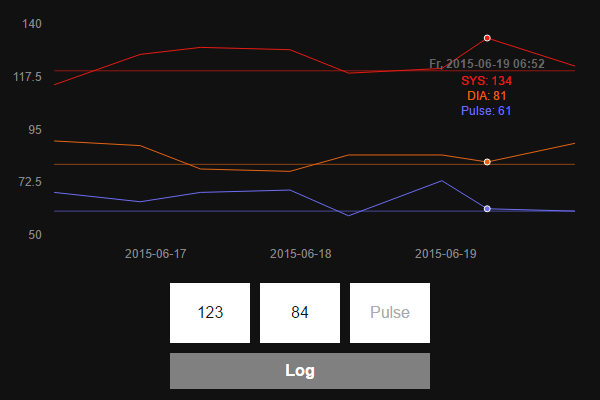

# Under Pressure
Keep track of your blood pressure.

## Requirements
Webserver with PHP 5+

## Installation

### Visualize log data
- Clone repository to webserver
- Open web app in browser (e.g. http://example.com/under-pressure)
- To remove the example entries delete or empty file "log.csv"

## External resources
- [morris.js](http://morrisjs.github.io/morris.js) ([Github](https://github.com/morrisjs/morris.js))
- [Raphaël](http://raphaeljs.com)
- [jQuery](http://jquery.com/) ([Github](https://github.com/jquery/jquery))
- [Add To Homescreen](http://cubiq.org/add-to-home-screen) ([Github](https://github.com/cubiq/add-to-homescreen))
- Icons made by [Freepik](http://www.flaticon.com/authors/freepik) from [www.flaticon.com](http://www.flaticon.com) is licensed by [Creative Commons BY 3.0](http://creativecommons.org/licenses/by/3.0/)

## License
The MIT License (MIT)